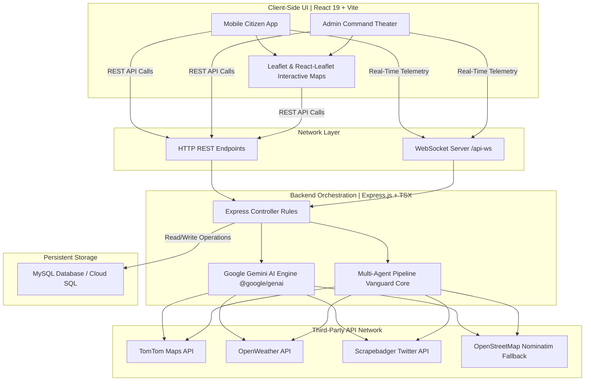
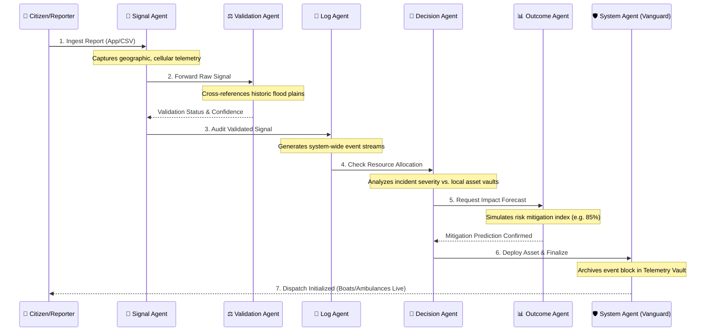

<div align="center">
  
  
  # 🛡️ CIRO Pakistan
  ### **Crisis Incident Reporting & Orchestration Platform**
  *The Unified Digital Command Theater for National Emergency Management & Smart Dispatch*

  [](https://nodejs.org/)
  [](https://react.dev/)
  [](https://deepmind.google/technologies/gemini/)
  [](https://www.mysql.com/)
  [](https://opensource.org/licenses/MIT)
</div>

---

## 📖 Table of Contents
1. [🌟 Executive Overview](#-executive-overview)
2. [🏗️ Architectural Framework](#%EF%B8%8F-architectural-framework)
3. [🤖 The AI Agent Network](#-the-ai-agent-network)
4. [🔌 Live & Mock API Integrations](#-live--mock-api-integrations)
5. [🔄 End-to-End Operational Workflow](#-end-to-end-operational-workflow)
6. [🗄️ Database Architecture](#%EF%B8%8F-database-architecture)
7. [🛠️ Local Installation & Development Guide](#%EF%B8%8F-local-installation--development-guide)
8. [🌍 Core Project Alignment](#-core-project-alignment)

---

## 🌟 Executive Overview
**CIRO (Crisis Incident Reporting & Orchestration) Pakistan** is a state-of-the-art multi-agent crisis management platform engineered to resolve fragmented communication and slow dispatch in regional emergency management. 

By integrating **Google Gemini 3 AI Core Reasoning**, interactive **GIS Spatial Analysis**, **Real-Time WebSockets**, and **Multi-Agent Simulation Pipelines**, CIRO unifies citizens and disaster command centers (NDMA, PDMA, PMD) during critical situations such as flash floods, severe heatwaves, road blockages, and medical emergencies.

### Key Capabilities:
*   **Dual Dashboards**: Responsive, consumer-grade Mobile/Web App for citizen incident reporting alongside a premium high-density Control Center Admin Dashboard.
*   **Voice-Driven Stress-Free reporting**: AI-powered audio processing that automatically extracts incident details and names from Urdu, English, and Roman Urdu voice inputs.
*   **Live Satellite & GIS Layering**: Interactive routing, weather warnings, and localized hazard zoning (Precipitation overlays, Elevation contours, Flow vectors).
*   **Vanguard Multi-Agent Command Pipeline**: Seamless sequential orchestration of six independent agents verifying, grading, logging, and dispatching crisis rescue assets.

---

## 🏗️ Architectural Framework

CIRO implements a highly responsive, modern client-server architecture built on **TypeScript (Vite + Express)**, guaranteeing robust typings and fast local executions.

---



*   **Client Layer (React 19 + Tailwind CSS + Lucide Icons)**: Dynamic UI rendering enriched with advanced **Framer Motion (`motion/react`)** visual orchestration:
    *   *Micro-Animations*: Levitating card effects, dynamic grid scaling, and smooth hover state-lifting.
    *   *Interactive Transitions*: Fluid side-panel drawer sliding, progressive multi-step form entry sequences, and pulsing crisis alert tickers.
    *   *Telemetry Visualization*: Real-time animated status logs that stream sequentially to represent multi-agent logical processing steps.
*   **Map Engine (Leaflet + React-Leaflet)**: Renders standard tiles, customized overlays, and markers with strict geographical coordinate clipping for Pakistan (`lat: 23.0 to 37.5, lng: 60.0 to 80.0`). Employs **flyTo smooth camera animations** to seamlessly shift focus to active dispatch routes.
*   **Server Engine (Express.js + TypeScript Executable `tsx`)**: Manages routing, processes incoming telemetry, and runs the Google GenAI orchestrator.
*   **Telemetry Server (WS Server / WebSockets)**: Broadcasts real-time events to all active dashboard sockets instantly, ensuring no delay in dispatch notifications.
*   **Database (MySQL Community Server / Google Cloud SQL)**: Normalization-oriented schema with transactional rollbacks for handling multi-incident classifications.


---

## 🤖 The AI Agent Network

The core value of CIRO Pakistan lies in its two layers of intelligent software agents: **Core AI Service Agents (Backend)** powered by Google Gemini and the **Operational Simulation Agents (Frontend Command Theater)**.

### 1. Core AI Service Agents (Backend)
These backend services use the latest `gemini-3-flash-preview` models from `@google/genai` to perform real-world critical workflows:

| Agent Profile | Technology | Operational Functionality |
| :--- | :--- | :--- |
| **📡 Voice Autofill Agent** | Gemini Multimodal Audio | Extracts the user's name and structured incident description from raw, recorded WebM audio containing code-switched languages (Urdu, English, Roman Urdu). |
| **🔍 Authentic Alerts Agent** | Gemini Search Tooling | Leverages Google Search tools within Gemini to fetch verified emergency weather, heavy rain, and flood alerts directly from official sources (NDMA, PDMA, PMD). |
| **📊 Confidence Scoring Agent** | Gemini Mathematical Logic | Automatically assigns a reliability score ($0-100\%$) to incoming citizen reports by cross-referencing metadata, evidence, and NASA rainfall simulations. |
| **📸 Image Verification Agent** | Gemini Vision Model | Analyzes submitted evidence photos for road blockages to determine if it is a real localized image or a stock/AI-generated fake. |
| **💬 Social Feed Agent** | Gemini Text Generation | Scrapes live crisis posts via Scrapebadger or falls back to generating localized Urdu-English bilingual chatter for sentiment monitoring. |

---

### 2. Operational Simulation Agents (Command Theater)
When a citizen report is ingested, the system fires a sequential **Vanguard Multi-Agent Simulation Pipeline** that models a complete crisis response operation:



*   **📡 Signal Agent**: The first contact point. It ingests incoming data signals (Mobile App form entries or batch CSV files), sets up initial coordinate parameters, and initializes tracking ID hashes.
*   **⚖️ Validation Agent (Reasoning)**: Performs strict spatial validation. It cross-references the report's coordinates against active geographic terrain bounds, elevation profiles, and satellite precipitation inputs to verify legitimacy and assign a baseline verification status.
*   **🧠 Understanding Agent (Reasoning)**: The linguistic and context-parsing brain. It translates and parses the natural language descriptions (Urdu script, English, or Roman Urdu) using AI to extract key emergency markers, severity classes, and infrastructure impact indicators.
*   **📜 Log Agent**: Acts as the system auditor and sequential narrator. It creates clean, structured, and chronological audit trail logs of the incident life cycle and verifies database transaction readiness.
*   **🎯 Decision Agent (Reasoning)**: The core routing and allocation mastermind. It evaluates incident urgency against local resource balances (Rescue 1122 active boat stations, municipal fire departments, local hospitals) and coordinates the optimal asset deployment plan.
*   **📊 Outcome Agent (Reasoning)**: Runs predictive simulation loops. It calculates estimated risk mitigation percentiles and impact mitigation metrics based on dispatch latency, terrain variables, and asset scale prior to physical vehicle deployment.
*   **🛡️ System Agent (Vanguard Core)**: The overarching database and state manager. It locks verified emergency entries into standard relational tables (e.g., details_flooding, details_heatwave), triggers live notifications, and keeps the global dashboards synchronized.


---

## 🔌 Live & Mock API Integrations

CIRO utilizes a robust integration strategy, gracefully falling back to mock layers if API limits are reached, guaranteeing $100\%$ platform uptime during demos.

```
                  ┌────────────────────────────────────────┐
                  │          CIRO API INTEGRATOR           │
                  └───────────────────┬────────────────────┘
                                      │
             ┌────────────────────────┴────────────────────────┐
             ▼                                                 ▼
   [ Real-Time Data APIs ]                           [ Mapping & GIS Engine ]
   ├── Gemini AI (Real Search & Audio)               ├── TomTom Maps API (Geocode/Routes)
   ├── Scrapebadger (Real Twitter Scrapes)           ├── OpenWeather (Weather & Forecasts)
   └── MySQL Pool (Local/Cloud DB)                   └── OpenStreetMap (Fallback Tiles)
```

1.  **Google Gemini AI API (Real)**:
    *   *Usage*: Complete parsing of speech, vision validation, official search integration.
    *   *Key API Package*: `@google/genai`
2.  **Scrapebadger API (Real / Hybrid Mock)**:
    *   *Usage*: Connects directly to `https://scrapebadger.com/v1/twitter/tweets/search` using custom headers to scrape active crisis tweets about Pakistani infrastructure (Karachi waterlogging, Lahore smog, KKH landslides).
    *   *Fallback*: If the custom API key is missing, it falls back to a Gemini-generated rich simulated Urdu-script social feed.
3.  **OpenWeather Map API (Real / Hybrid Mock)**:
    *   *Usage*: Queries live current weather and 5-day forecasts for the user's geolocated coordinates to calculate immediate localized flood risk.
    *   *Fallback*: Generates typical seasonal forecasts (Monsoon/Summer) dynamically.
4.  **TomTom Maps API (Real / Hybrid Mock)**:
    *   *Usage*: Renders high-quality vector tiles, reverse geocodes latitude/longitude coordinates to exact Pakistani street addresses, and calculates real-time routes with traffic details.
    *   *Fallback*: Fallbacks to OpenStreetMap Nominatim for geocoding and standard OSM Mapnik tiles for map views.

---

## 🔄 End-to-End Operational Workflow

The step-by-step incident management lifecycle in CIRO Pakistan operates as follows:

```
[ Citizen Report ] ➔ [ Voice/Image Verification ] ➔ [ Master Database Log ]
                                                               │
┌──────────────────────────────────────────────────────────────┘
▼
[ WebSocket Broadcast ] ➔ [ Multi-Agent Processing ] ➔ [ Active Routing & Dispatch ]
```

1.  **Reporting**: A citizen files an emergency report (Urban Flooding, Heatwave, Road Blockage, Power Outage, Health, Disease Spike, or Accident) via text, image upload, or audio.
2.  **Verifying & Logging**: The server processes the voice inputs, verifies the images, calculates confidence metrics, and writes the incident into the MySQL transaction block.
3.  **Broadcasting**: The server broadcasts a notification via WebSockets, instantly populating the Admin Dashboard without requiring a manual refresh.
4.  **Simulating Vanguard Pipeline**: The Admin starts the agent analysis, triggering the multi-agent console which displays real-time animated logs from each agent in the chain.
5.  **Deploying & Routing**: The system calculates the fastest route from the nearest rescue station (e.g., Rescue 1122 Head Office) to the incident location, overlaying real-time routing paths and dispatch statuses on the main map.

---

## 🗄️ Database Architecture

CIRO uses a clean, highly structured relational schema database named `ciro_pakistan`. It features a master incident table that links to specific detail tables using foreign keys (`ON DELETE CASCADE`), ensuring data integrity.

```
                      ┌──────────────────────┐
                      │    users (Citizen)   │
                      └──────────┬───────────┘
                                 │ (1 : N)
                      ┌──────────▼───────────┐
                      │      incidents       │  ◄── Master Table
                      └────┬───┬───┬───┬───┬─┘
     ┌─────────────────────┼───┼───┼───┼───┼─────────────────────┐
     ▼                     ▼   ▼   ▼   ▼   ▼                     ▼
┌────────────┐ ┌──────────┐ ┌────────┐ ┌────────┐ ┌────────┐ ┌────────┐ ┌────────┐
│  flooding  │ │ heatwave │ │blockage│ │ outage │ │ health │ │ disease│ │accident│
└────────────┘ └──────────┘ └────────┘ └────────┘ └────────┘ └────────┘ └────────┘
                       (Sub-type Detailed Tables)
```

### Table Schema Breakdown:
1.  **`users`**: Manages citizen details, passwords, and unique system-generated `citizenId` strings.
2.  **`incidents`**: The core master table. Stores locations, coordinates (`lat`, `lng`), confidence ratings, statuses (`Pending`, `Processing`, `Solved`), descriptions, and binary image uploads.
3.  **Detail Tables**:
    *   **`details_flooding`**: Tracks details on affected urban structures.
    *   **`details_heatwave`**: Tracks maximum temperatures, heat illness tags, and local mitigation efforts.
    *   **`details_road_blockage`**: Tracks obstruction descriptions and image verification status flags.
    *   **`details_power_outage`**: Tracks transformer issues, voltage logs, and outage durations in hours.
    *   **`details_health`**: Tracks personal medical emergency details.
    *   **`details_disease_spike`**: Tracks symptoms, contagion rates, and affected counts for regional epidemic control.
    *   **`details_accident`**: Tracks collision types, casualty numbers, and vehicle counts.

---

## 🛠️ Local Installation & Development Guide

Follow these steps to set up and run CIRO Pakistan on your local development machine:

### Prerequisites:
*   **Node.js**: Version 18.x or higher (LTS recommended)
*   **MySQL**: Community Server or via XAMPP/WampServer

---

### Step 1: Clone & Navigate to Project Directory
Open your terminal (PowerShell, Command Prompt, or Bash) and navigate to the project subfolder containing the `package.json` file:
```powershell
cd "C:\AI_Seekho_Final\CIRO-last\CIRO-last"
```

---

### Step 2: Install Node Dependencies
Download all the front-end and back-end libraries compiled in the project manifests:
```powershell
npm install
```
> [!NOTE]
> This command installs the React 19 framework, Express server, Google GenAI SDK, Leaflet mapping engines, Vite bundler, and utility libraries inside the `node_modules/` folder.

---

### Step 3: Configure Your Local Database
1.  Open your MySQL utility (e.g., **phpMyAdmin** at `http://localhost/phpmyadmin` or the MySQL CLI).
2.  Create a new database named `ciro_pakistan`:
    ```sql
    CREATE DATABASE ciro_pakistan;
    ```
3.  Import the structure by running the SQL commands inside **`database_schema.sql`**:
    ```powershell
    mysql -u root -p ciro_pakistan < database_schema.sql
    ```

---

### Step 4: Configure the Environment Variables (`.env`)
Create a `.env` file in the root folder (or modify your existing one) to specify your database connections and API keys:

```env
# 🗄️ Database Configurations
DB_HOST=localhost
DB_PORT=3306
DB_USER=root
DB_PASSWORD=YOUR_MYSQL_PASSWORD  # Keep empty if no password is set
DB_NAME=ciro_pakistan

# 🤖 Artificial Intelligence Configurations
GEMINI_API_KEY=AIzaSy...  # Your Google Gemini API Key

# 🌍 Geospatial & Scraper API Configurations
VITE_TOMTOM_API_KEY=YOUR_TOMTOM_API_KEY  # Mapbox / TomTom key
VITE_OPENWEATHER_API_KEY=YOUR_OPENWEATHER_API_KEY
SCRAPEBADGER_API_KEY=YOUR_SCRAPEBADGER_KEY  # Optional for live Twitter data
```

---

### Step 5: Start the Development Server
Run the local development command to spin up the Express server and Vite compilation pipeline simultaneously:
```powershell
npm run dev
```
Upon a successful start, you should see the following logs in your console:
```bash
🔌 Configuring database connection via Host: localhost:3306
✅ Successfully connected to MySQL Database.
🔧 Successfully ensured incidents.status column is VARCHAR(50).
📦 Database Tables: users, incidents, details_flooding, details_heatwave, details_road_blockage, details_power_outage, details_health, details_disease_spike, details_accident
Server running at http://localhost:8080
```

Open your browser and navigate to **[http://localhost:3000](http://localhost:3000)** to access the operational application!

---

## 🌍 Core Project Alignment
This platform is custom-built for **AI Seekho 2026**. By blending cutting-edge generative AI models with classical relational database normalization and real-time geospatial visualizations, CIRO Pakistan demonstrates how smart technology can make civic infrastructure more resilient.

---
<div align="center">
  <b>Developed with 💚 for AI Seekho 2026 | CIRO Pakistan Command Center</b>
</div>
