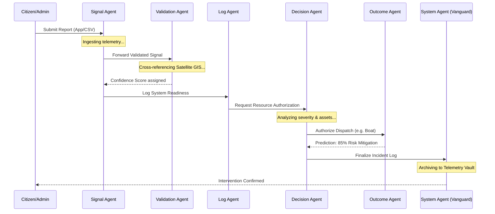

# 🛡️ CIRO Pakistan: Multi-Agent Architecture

CIRO (Crisis Response & Infrastructure Monitoring) Pakistan leverages a sophisticated multi-agent system to manage and respond to emergencies across the country. The project integrates real-time AI processing with geospatial data to provide a unified command theater for crisis management.

## 🤖 Agent Profiles

The system is powered by several specialized agents, categorized into **Core AI Service Agents** (Backend) and **Operational Simulation Agents** (Frontend/Command Center).

### 1. Core AI Service Agents (Backend)
*Driven by Google Gemini AI*

| Agent | Responsibility | Key Features |
| :--- | :--- | :--- |
| **Authentic Alerts Agent** | Real-time Threat Detection | Uses Google Search tools to fetch the latest critical alerts from PMD, NDMA, and PDMA. Focuses on floods, heatwaves, and weather warnings. |
| **Social Feed Agent** | Public Sentiment & Context | Generates and analyzes simulated social media posts (Twitter/WhatsApp) in Urdu and English to provide local context for emerging issues. |
| **Voice Autofill Agent** | Intelligent Data Entry | Processes voice reports (WebM audio) to automatically extract names and phone numbers, simplifying report submission for citizens in high-stress situations. |
| **Confidence Scoring Agent** | Report Verification | Cross-references citizen-reported data with satellite rainfall intensity (NASA GPM simulation) and metadata to assign a confidence score (0-100%). |

### 2. Operational Simulation Agents (Command Center)
*Simulating the Vanguard Core pipeline for emergency response*

*   **📡 Signal Agent**: The first point of contact. It ingests incoming reports, initializes neural telemetry, and categorizes the signal based on sector mapping.
*   **⚖️ Validation Agent**: Performs spatial verification. It cross-references coordinates with historical flood plains and satellite imagery to ensure report integrity.
*   **📜 Log Agent**: Acts as the system's "narrator." It audits the internal system status and prepares the environment for asset dispatch.
*   **🎯 Decision Agent**: The brains of the operation. It analyzes severity metrics against regional resource availability and authorizes specific actions (e.g., "Dispatching 3 boats to Nowshera Sector").
*   **📊 Outcome Agent**: Predicts the success of an intervention. It calculates estimated risk mitigation and archives the final verification once an incident is stabilized.
*   **🛡️ System Agent (Vanguard Core)**: The overseer. It coordinates batch operations, manages the global state, and ensures all telemetry is archived in the secure vault.

## 🚀 Technical Workflow

### Agent Sequence Diagram

1.  **Ingestion**: A report is received via the Mobile App (Citizen) or CSV Upload (Admin).
2.  **Triangulation**: The **Signal Agent** identifies the sector.
3.  **Verification**: The **Validation Agent** assigns a confidence score.

4.  **Prioritization**: The **Decision Agent** selects the most critical incidents for immediate response.
5.  **Deployment**: Real-time assets (Boats, Ambulances) are tracked on the **Active Command Theater** map.
6.  **Archiving**: The **Outcome Agent** logs the results for future post-disaster analysis.

---
*Developed for the AI Seekho 2026 Initiative.*
